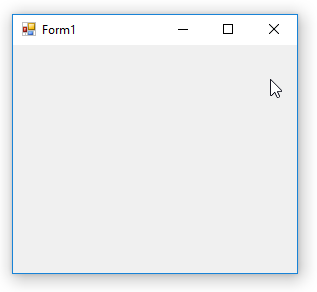
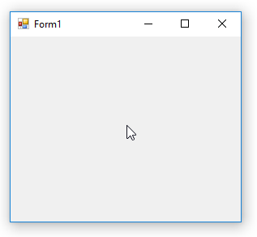

# Auto-hide Menu Example

You can create an auto-hide menu strip. To show and hide the menu, it's enough to set its `Visible` property. But to make it auto-hide you should handle a couple of other events:

To show or hide it based on mouse position, you can use a timer and in the time check if the mouse is close to the top edge of the form, then show the menu.

To hide it, you can check if the mouse is not in the client area of the menu, and there is no menu item activated or open, then you can hide it. In the example, I used two different timers for show and hide to be able to set different delay for show and hide:

To activate it by <kbd>Alt</kbd> key, you can override `ProcessCmdKey` to handle <kbd>Alt</kbd> key to toggle the menu visibility. Also to activate menu, call internal `OnMenuKey` method of `MenuStrip`. Also handle `MenuDeactivate` to make the menu invisible after finishing your work with menu, but you need to make the menu invisible using `BeginInvoke`:

